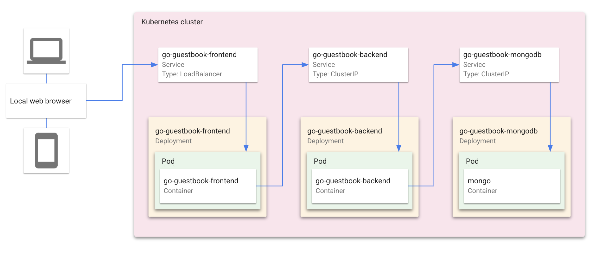

# Tarea2 - Kubernetes
## Integrantes:
* Diego Linares y Guillermo Franco

## 1. Deploying Kubernetes

### 1.1 Single Node

`minikube start --nodes 1 -p single-node`

### 1.2 Multi Node

`minikube start --nodes 3 -p multi-node`

## 2. Search and select a containerized application

### 2.1 Guestbook

* Funcionalidad: Añadir y visualizar nombres y mensajes en una interfaz web
* Arquitectura 

* [Código](guestbook-1)

## 3. Deployment a containerized application on kubernetes

### 3.1 Deploying App

* [Video del deployment](3.1.mp4)

### 3.2 Flow
